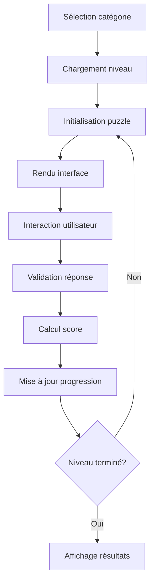

# Architecture CogniQuest++ 🏗️

## Vue d'ensemble architecturale

CogniQuest++ suit une architecture modulaire basée sur React avec une séparation claire des responsabilités entre présentation, logique métier et gestion des données.

## 🎯 Principes architecturaux

### 1. Séparation des préoccupations
- **Présentation** : Composants React purs
- **Logique métier** : Hooks personnalisés et services
- **Données** : Couche de données centralisée
- **Sécurité** : Système anti-cheat isolé

### 2. Modularité
- Composants réutilisables
- Types TypeScript stricts
- Services découplés
- Configuration centralisée

### 3. Scalabilité
- Structure de dossiers évolutive
- Lazy loading des composants
- Optimisation des performances
- Cache intelligent

## 📁 Structure des dossiers

```
src/
├── components/                 # Composants réutilisables
│   ├── ui/                    # Composants UI de base (Shadcn)
│   │   ├── button.tsx
│   │   ├── card.tsx
│   │   ├── input.tsx
│   │   └── ...
│   ├── puzzles/               # Système de puzzles
│   │   ├── PuzzleRenderer.tsx # Orchestrateur principal
│   │   └── types/             # Types de puzzles spécifiques
│   │       ├── RiddlePuzzle.tsx
│   │       ├── VisualPuzzle.tsx
│   │       ├── LogicPuzzle.tsx
│   │       ├── SequencePuzzle.tsx
│   │       ├── MemoryPuzzle.tsx
│   │       ├── CalculationPuzzle.tsx
│   │       ├── SpatialPuzzle.tsx
│   │       ├── EmotionalPuzzle.tsx
│   │       ├── OrientationPuzzle.tsx
│   │       └── LanguagePuzzle.tsx
│   ├── security/              # Système anti-cheat
│   │   └── AntiCheatProvider.tsx
│   ├── Header.tsx             # Navigation principale
│   ├── CategoryCard.tsx       # Cartes de catégories
│   └── Dashboard.tsx          # Tableau de bord utilisateur
├── data/                      # Données statiques
│   ├── categories.ts          # Définitions des catégories
│   └── puzzles.ts            # Base de données des puzzles
├── hooks/                     # Hooks personnalisés
│   └── use-mobile.ts         # Détection mobile
├── lib/                       # Utilitaires
│   └── utils.ts              # Fonctions utilitaires
├── pages/                     # Pages principales
│   ├── Index.tsx             # Page d'accueil
│   ├── GamePage.tsx          # Interface de jeu
│   ├── ResultsPage.tsx       # Résultats et progression
│   └── NotFound.tsx          # Page 404
├── types/                     # Définitions TypeScript
│   └── puzzle.ts             # Types pour les puzzles
├── App.tsx                   # Composant racine
└── main.tsx                  # Point d'entrée
```

## 🧩 Composants principaux

### 1. App.tsx - Orchestrateur principal
```typescript
// Configuration globale
- React Query Client
- Router Configuration
- Providers (Tooltip, Toast, Anti-cheat)
- Routes définition
```

### 2. Pages principales

#### Index.tsx - Page d'accueil
```typescript
// Responsabilités:
- Affichage des catégories
- Gestion de l'état de progression
- Navigation vers les niveaux
- Dashboard utilisateur
```

#### GamePage.tsx - Interface de jeu
```typescript
// Responsabilités:
- Gestion de session de jeu
- Timer et scoring
- Rendu des puzzles
- Système anti-cheat actif
- Navigation entre puzzles
```

#### ResultsPage.tsx - Résultats
```typescript
// Responsabilités:
- Affichage des performances
- Calcul de progression
- Déblocage de niveaux
- Recommandations IA
```

### 3. Système de puzzles

#### PuzzleRenderer.tsx - Orchestrateur
```typescript
// Fonctionnalités:
- Factory pattern pour les types de puzzles
- Gestion des réponses utilisateur
- Calcul des scores
- Validation des solutions
- Mesure du temps de réponse
```

#### Types de puzzles spécialisés
Chaque type de puzzle hérite d'une interface commune :

```typescript
interface PuzzleComponentProps {
  puzzle: Puzzle;
  onAnswer: (answer: any) => void;
  isAnswered: boolean;
}
```

### 4. Système de sécurité

#### AntiCheatProvider.tsx
```typescript
// Mesures de sécurité:
- Détection de perte de focus
- Blocage des outils développeur
- Analyse des patterns de mouvement
- Protection contre copier-coller
- Monitoring d'inactivité
- Système de violations graduelles
```

## 🔄 Flux de données

### 1. Architecture unidirectionnelle
```
User Action → State Update → UI Re-render → Side Effects
```

### 2. Gestion d'état
- **React Query** : Cache et synchronisation
- **Context API** : État global (anti-cheat)
- **localStorage** : Persistance locale
- **State React** : État local des composants

### 3. Cycle de vie d'un puzzle


## 🎨 Couche de présentation

### 1. Design System
- **Shadcn/UI** : Composants de base
- **Tailwind CSS** : Styling utilitaire
- **CSS Variables** : Thème personnalisé
- **Responsive Design** : Mobile-first

### 2. Thème stellaire
```css
:root {
  --cosmic-500: #8B5CF6;
  --stellar-400: #06B6D4;
  --dark: #0F172A;
  --gradient-cosmic: linear-gradient(135deg, var(--cosmic-500), var(--stellar-400));
}
```

### 3. Animations et transitions
- **CSS Transitions** : Hover effects
- **Transform animations** : Cartes et boutons
- **Gradient animations** : Effets de glow
- **Progress animations** : Barres de progression

## 🔧 Services et utilitaires

### 1. Gestion des puzzles
```typescript
// services/puzzleService.ts
class PuzzleService {
  generatePuzzle(category: string, level: number): Puzzle
  validateAnswer(puzzle: Puzzle, answer: any): boolean
  calculateScore(time: number, difficulty: number): number
  getNextPuzzle(currentId: string): Puzzle
}
```

### 2. Service de progression
```typescript
// services/progressService.ts
class ProgressService {
  updateUserProgress(category: string, level: number, score: number): void
  checkLevelUnlock(category: string, level: number): boolean
  calculateXP(baseScore: number, bonus: number): number
  getRecommendations(userHistory: UserStats): Recommendation[]
}
```

### 3. Service de sécurité
```typescript
// services/securityService.ts
class SecurityService {
  detectAnomalies(userBehavior: BehaviorData): SecurityAlert[]
  validateResponseTime(startTime: number, endTime: number): boolean
  encryptUserData(data: any): string
  generateSecurityFingerprint(): string
}
```

## 🚀 Optimisations de performance

### 1. Bundle splitting
- **Lazy loading** des pages
- **Code splitting** par route
- **Dynamic imports** pour les composants lourds

### 2. Mémoire et CPU
- **React.memo** pour les composants purs
- **useMemo** pour les calculs coûteux
- **useCallback** pour les fonctions stables
- **Debouncing** des inputs utilisateur

### 3. Réseau
- **React Query** : Cache intelligent
- **Service Worker** : Cache des assets
- **Compression** : Gzip/Brotli
- **CDN** : Assets statiques

## 🔒 Architecture de sécurité

### 1. Couches de sécurité
```
Couche 1: Interface utilisateur (Détection comportementale)
Couche 2: Validation côté client (Checksums, timestamps)
Couche 3: Chiffrement des données (Local storage)
Couche 4: Monitoring en temps réel (Anomalies)
```

### 2. Patterns de sécurité
- **Observer Pattern** : Surveillance des événements
- **Strategy Pattern** : Différentes mesures anti-cheat
- **Command Pattern** : Actions de sécurité
- **State Machine** : États de violation

## 📊 Monitoring et observabilité

### 1. Métriques applicatives
- Temps de réponse des puzzles
- Taux de réussite par catégorie
- Progression des utilisateurs
- Détection d'anomalies

### 2. Métriques techniques
- Performance des composants
- Temps de chargement
- Erreurs JavaScript
- Utilisation mémoire

### 3. Logs et debugging
- **Console.log** structuré
- **Error boundaries** React
- **Source maps** pour debugging
- **Performance profiling**

## 🔄 Évolutivité

### 1. Extensibilité
- **Plugin system** pour nouveaux types de puzzles
- **Theming system** extensible
- **API abstraite** pour différents backends
- **Configuration externalisée**

### 2. Maintenabilité
- **Tests unitaires** avec Jest
- **Tests d'intégration** avec Testing Library
- **Documentation automatique** avec JSDoc
- **Linting** avec ESLint

### 3. Déploiement
- **CI/CD pipeline** avec GitHub Actions
- **Environnements multiples** (dev/staging/prod)
- **Rollback automatique** en cas d'erreur
- **Monitoring post-déploiement**

---

Cette architecture assure une base solide, sécurisée et évolutive pour CogniQuest++, permettant une expérience utilisateur optimale tout en maintenant des standards élevés de qualité et de sécurité.
